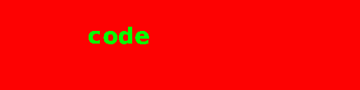

# Learn To CODE!

CODE is a revolutionary new programming language designed throughout 2022 and 2023. It is inspired by some of the greatest and most widely-respected languages ever created, such as INTERCAL and PHP.

# Example

Compute the Fibonacci numbers:

```
x = int
x = 1
y = int
y = 1
z = int
print 1
print 1
come from 12
z = x + y
x = y
y = z
print z
```
